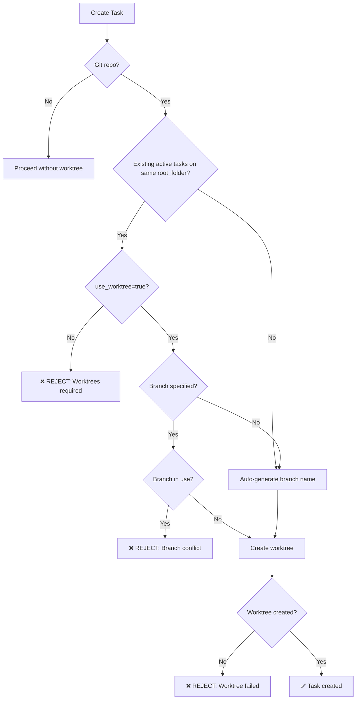

# Parallel Tasks Design - Branch Isolation

## Core Principle

**Tasks on the same `root_folder` MUST use different branches and worktrees.**

This ensures:
- ✅ Complete isolation between parallel tasks
- ✅ No file conflicts or race conditions
- ✅ Separate Claude CLI conversation contexts
- ✅ Independent git history per task

## Design Rules

### Rule 1: One Branch Per Active Task
When multiple tasks run on the same project, each MUST use a different git branch.

```python
# Validation in endpoints.py:156-161
if branch_name in used_branches:
    raise HTTPException(
        status_code=400,
        detail=f"Branch '{branch_name}' is already being used by another active task"
    )
```

### Rule 2: Worktrees Required for Parallel Tasks
If another active task exists on the same `root_folder`, worktrees are **mandatory**.

```python
# Validation in endpoints.py:164-169
if existing_tasks and not task_data.use_worktree:
    raise HTTPException(
        status_code=400,
        detail="You must use worktrees (use_worktree=true) for parallel task execution"
    )
```

### Rule 3: Auto-Generate Unique Branch Names
If no `branch_name` is specified, the system auto-generates:

```
task/{task_name}
```

Examples:
- Task: `add-login` → Branch: `task/add-login`
- Task: `fix/bug-123` → Branch: `task/fix_bug-123`
- Task: `feature api` → Branch: `task/feature_api`

## How It Works

### Scenario 1: Single Task on Project

```bash
# First task - No existing tasks
POST /api/v1/tasks
{
  "task_name": "add-login",
  "root_folder": "/Users/me/myapp",
  "use_worktree": true
}
```

**System behavior:**
1. ✅ No existing active tasks detected
2. ✅ Auto-generates branch: `task/add-login`
3. ✅ Creates worktree: `/Users/me/myapp/.claude_worktrees/add-login/`
4. ✅ Task proceeds normally

### Scenario 2: Second Task on Same Project

```bash
# Second task - One task already running
POST /api/v1/tasks
{
  "task_name": "add-logout",
  "root_folder": "/Users/me/myapp",  # SAME project
  "use_worktree": true
}
```

**System behavior:**
1. ✅ Detects existing task on `root_folder`
2. ✅ Auto-generates branch: `task/add-logout` (different from `task/add-login`)
3. ✅ Validates branch is not in use
4. ✅ Creates separate worktree: `/Users/me/myapp/.claude_worktrees/add-logout/`
5. ✅ Both tasks run in parallel, isolated

### Scenario 3: Branch Conflict Prevention

```bash
# Attempt to use same branch as existing task
POST /api/v1/tasks
{
  "task_name": "another-task",
  "root_folder": "/Users/me/myapp",
  "branch_name": "task/add-login"  # Already in use!
}
```

**System response:**
```json
{
  "detail": "Branch 'task/add-login' is already being used by another active task on this project. Please specify a different branch_name or wait for the other task to complete."
}
```

❌ Task creation **fails** - prevents branch conflict

### Scenario 4: Worktree Disabled with Active Tasks

```bash
# Try to disable worktree when tasks exist
POST /api/v1/tasks
{
  "task_name": "risky-task",
  "root_folder": "/Users/me/myapp",
  "use_worktree": false  # Not allowed!
}
```

**System response:**
```json
{
  "detail": "Multiple tasks detected on project '/Users/me/myapp'. You must use worktrees (use_worktree=true) for parallel task execution."
}
```

❌ Task creation **fails** - enforces worktree usage

## Database vs Claude Sessions

### Two Types of Sessions

| Type | What It Is | Shared? | Purpose |
|------|------------|---------|---------|
| **Database Session** | MySQL record in `sessions` table | ✅ Shared by project | Groups tasks by `project_path` |
| **Claude CLI Session** | Conversation context in Claude CLI | ❌ Isolated per task | Each task has own conversation |

### How Isolation Works

```
Project: /Users/me/myapp (Database Session: abc-123)
├── Task 1: "add-login"
│   ├── Database: session_id = abc-123 (shared)
│   ├── Branch: task/add-login (unique)
│   ├── Worktree: /Users/me/myapp/.claude_worktrees/add-login/
│   └── Claude Session: Working directory = worktree path (isolated)
│
└── Task 2: "add-logout"
    ├── Database: session_id = abc-123 (shared - same project)
    ├── Branch: task/add-logout (unique - different branch)
    ├── Worktree: /Users/me/myapp/.claude_worktrees/add-logout/
    └── Claude Session: Working directory = worktree path (isolated)
```

**Key Point:** Different working directories → Different Claude conversations

## Validation Flow



## Code Reference

### Validation Logic
File: `app/api/endpoints.py`

**Branch uniqueness check:**
```python
# Line 142-145: Query active tasks
existing_tasks = db.query(Task).filter(
    Task.root_folder == root_folder,
    Task.status.in_([TaskStatus.PENDING, TaskStatus.RUNNING, TaskStatus.PAUSED])
).all()

# Line 156-161: Validate branch not in use
used_branches = [t.branch_name for t in existing_tasks if t.branch_name]
if branch_name in used_branches:
    raise HTTPException(status_code=400, detail="Branch already in use")
```

**Worktree enforcement:**
```python
# Line 164-169: Enforce worktree for parallel tasks
if existing_tasks and not task_data.use_worktree:
    raise HTTPException(status_code=400, detail="Must use worktrees")
```

### Task Execution
File: `app/services/task_executor.py`

**Working directory prioritization:**
```python
# Line 56: Worktree path takes priority
project_path = task.worktree_path or task.root_folder or session.project_path
```

This ensures Claude CLI runs in the isolated worktree directory.

## Best Practices

### ✅ Do This

```bash
# Let system auto-generate unique branches
POST /api/v1/tasks
{
  "task_name": "feature-1",
  "root_folder": "/project"
  # branch_name omitted - auto-generates task/feature-1
}

POST /api/v1/tasks
{
  "task_name": "feature-2",
  "root_folder": "/project"
  # branch_name omitted - auto-generates task/feature-2
}
```

### ✅ Or Use Explicit Unique Branches

```bash
POST /api/v1/tasks
{
  "task_name": "auth-task",
  "root_folder": "/project",
  "branch_name": "feature/oauth"
}

POST /api/v1/tasks
{
  "task_name": "payment-task",
  "root_folder": "/project",
  "branch_name": "feature/stripe"  # Different branch
}
```

### ❌ Don't Do This

```bash
# Don't use same branch for parallel tasks
POST /api/v1/tasks
{
  "task_name": "task-1",
  "root_folder": "/project",
  "branch_name": "develop"
}

POST /api/v1/tasks
{
  "task_name": "task-2",
  "root_folder": "/project",
  "branch_name": "develop"  # ❌ Same branch - REJECTED
}
```

```bash
# Don't disable worktrees with active tasks
POST /api/v1/tasks
{
  "task_name": "task-2",
  "root_folder": "/project",
  "use_worktree": false  # ❌ Active task exists - REJECTED
}
```

## Benefits

### 1. Complete Isolation
- Each task works in its own directory
- No file access conflicts
- Independent git state

### 2. Separate Conversations
- Claude CLI uses working directory for session storage
- Different directories = different conversations
- No context bleeding between tasks

### 3. Clean Git History
- Each feature on its own branch
- Easy to review changes per task
- Simple to merge or revert

### 4. Safe Parallel Execution
- Multiple tasks can run simultaneously
- No race conditions
- Automatic conflict prevention

## Error Messages

| Error | Cause | Solution |
|-------|-------|----------|
| "Branch already in use" | Trying to use same branch as active task | Use different `branch_name` or omit it |
| "Must use worktrees" | `use_worktree=false` with active tasks | Set `use_worktree=true` |
| "Failed to create worktree" | Git worktree command failed | Check git version, permissions, branch conflicts |
| "Git worktree not supported" | Git version < 2.5 | Upgrade git or use sequential tasks |

## Summary

The system enforces **strict branch isolation** for parallel tasks:

1. ✅ Auto-generates unique branch names per task
2. ✅ Validates branch uniqueness before task creation
3. ✅ Enforces worktree usage for parallel execution
4. ✅ Creates isolated Claude CLI sessions via separate directories
5. ✅ Prevents conflicts at task creation time, not runtime

This design ensures **safe, parallel task execution** without manual coordination.
